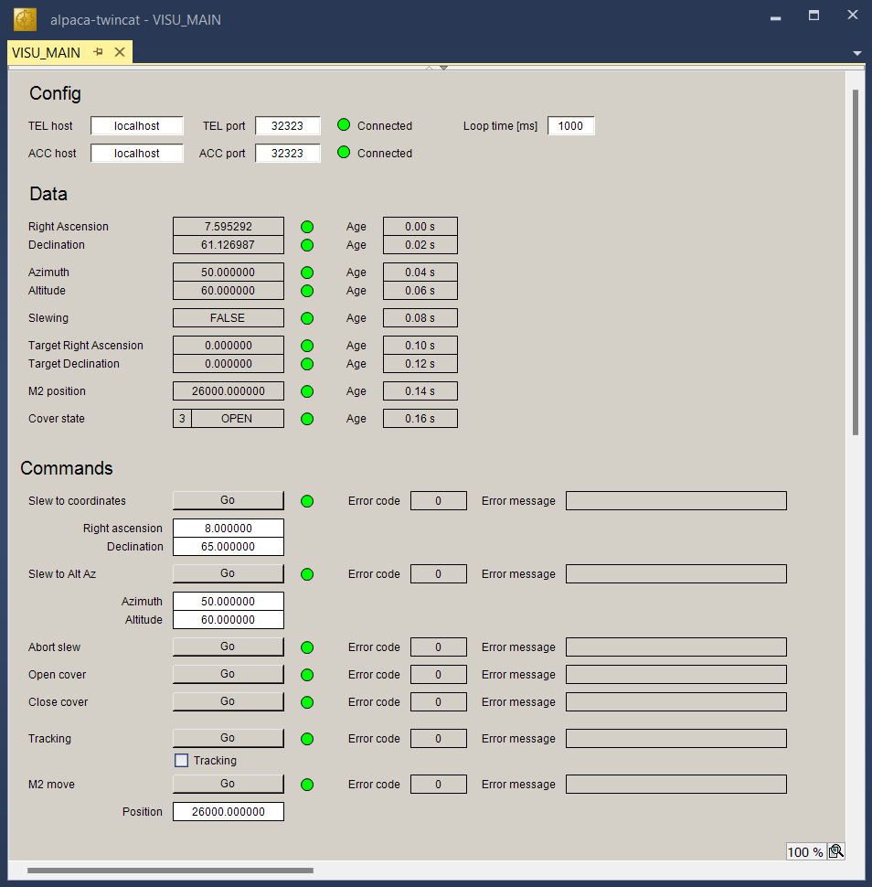
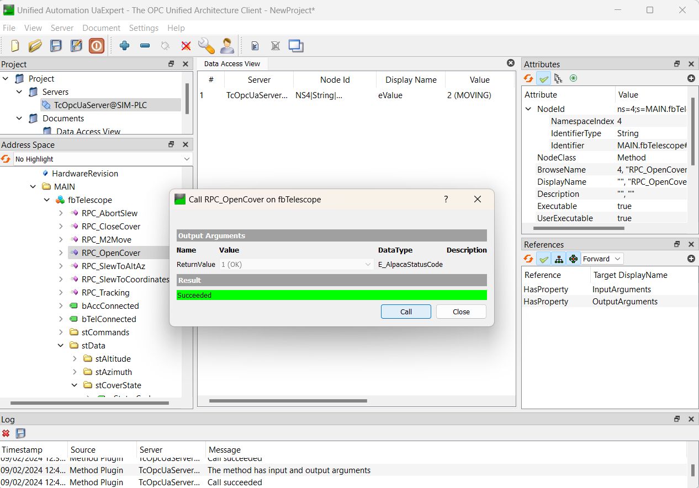

# tc3-alpaca
A TwinCAT3 library to control an ASA telescope via ASCOM/Alpaca.

## How to test the software
On the Beckhoff PLC itself, you can run the ASCOM.Alpaca.Simulators, and configure the PLC code to use ``localhost``.

-  Find the latest release of [ASCOM.Alpaca.Simulators](https://github.com/ASCOMInitiative/ASCOM.Alpaca.Simulators) on Github, e.g. [v0.3.1](https://github.com/ASCOMInitiative/ASCOM.Alpaca.Simulators/releases/tag/v0.3.1).
-  Download and unzip ``ascom.alpaca.simulators.windows-x64.zip`` (for a 64-bit PLC)
-  As user ``Administrator``, run the executable in the zip. There is no need to install anything.
-  A webbrowser will pop upen. Simply press "Connect" for the CoverCalibrator, the Focuser and the Telescope.

The ASA telescope uses 2 servers (one for the telescope called TEL, and one for the accessories called ACC), but the Alpaca simulators only use one server.
So to connect the PLC software to the simulator, in the ``MAIN`` program of the PLC code, make sure that the same host and port for both the telescope (TEL) and accessory (ACC) are entered:
 - host ``localhost``
 - port ``32323``

You can also edit these settings on-the-fly using the HMI (the HTTP client will automatically reconnect if the hosts or ports change).



## How to (easily) install and configure the OPC UA server

The latest versions of the TwinCAT OPC UA server are secure by default. To "unsecure" it (only if you are on a trusted network!) you can either use the configurator, or follow the steps below.

- On the Windows PLC, install the latest version of TF6100: currently ``TF6100-OPC-UA-Server-V5.exe``.
- Edit ``C:\TwinCAT\Functions\TF6100-OPC-UA\Win32\Server\TcUaServerConfig.xml`` using Notepad and add the following lines inside the ``<UaEndpoint>`` tag:
  ```
  <SecuritySetting>
    <SecurityPolicy>http://opcfoundation.org/UA/SecurityPolicy#None</SecurityPolicy>
    <MessageSecurityMode>None</MessageSecurityMode>
  </SecuritySetting>
  ```
- Add the ``C:\TwinCAT\Functions\TF6100-OPC-UA\Win32\Server\TcOpcUaServer.exe`` to the "allowed" list of applications for the Windows firewall.
- Log in to the OPC UA server using UaExpert. Call the method ``TrustOnFirstUse()`` with Username ``Administrator`` and the Windows password for ``Administrator``.
(See [InfoSys](https://infosys.beckhoff.com/english.php?content=../content/1033/tf6100_tc3_opcua/11181198347.html&id=7440912862876337930))
- Now a file ``C:\TwinCAT\Functions\TF6100-OPC-UA\Win32\Server\TcUaSecurityConfig.xml`` will have been created automatically. Edit it using Notepad and add the following line inside the ``<Users>`` tag: 
  ```
  <User Name="Anonymous" Auth="None" Password="" IsRoot="false" MemberOf="Administrators" />
  ```
- Restart the PLC. Now you should be able to log in anonymously using the None/None endpoint.

